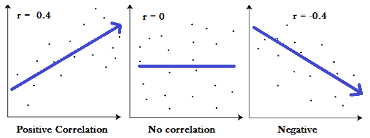

## Correlation Coefficient 
### 1. Introduction & Function
Correlation coefficients are used in statistics to measure how strong a relationship is between two variables, which in our case is, how strong a relationship is between two stocks. 

Correlation coefficient formulas are used to find how strong a relationship is between data. The formulas return a value between -1 and 1, where:

1 indicates a strong positive relationship.

-1 indicates a strong negative relationship.

A result of zero indicates no relationship at all.



There are several types of correlation coefficient formulas.

One of the most commonly used formulas in stats is Pearson’s correlation coefficient formula. 


### 2. Pinescript Tutorial
#### · Initial Setting 

```
//@version=4
study("Correlation Coefficient")
```

#### · Parameter Setting 

```
length = input(title = "period", type=input.integer, defval=120)            // Set the number of bars back
symbolName = input(title="Symbol", type = input.symbol, defval= "AMEX:SPY") // Get the other stock's name that we want to compare
symbolClose = security(symbolName, "D", close)                              // Get the close price of the other stock
cc = correlation(symbolClose, close, length)                                // Calculate Correlation Coefficient
```

#### · Plotting 
```
plot(cc)
```
